<p align="center">
  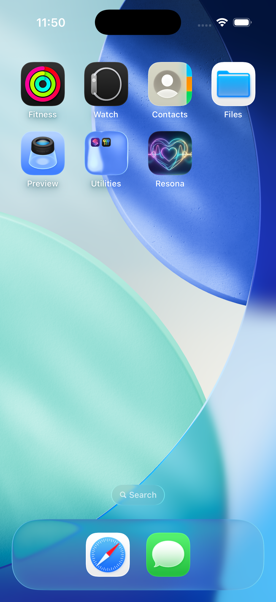
</p>

# Resona

**Voice-first dating for deeper human connection.**

---

## 1. The Problem

Modern dating apps are broken in the same way: they reduce people to a photo grid and a 150-character bio, then ask you to make snap judgments. The result is predictable — shallow matches, ghosting, and dating fatigue.

What's missing is the most human signal of all: **voice**. How someone speaks — their warmth, their pauses, the way they light up on a topic — reveals more about compatibility than any curated photo ever could. Yet no mainstream app captures it.

**Core pain points today:**

- **Visual-first swiping** rewards attractiveness over compatibility, leading to high match rates but low conversation quality.
- **Text bios are performative** — people write what they think others want to read, not who they actually are.
- **No depth signal before commitment** — you invest time in a match only to discover zero conversational chemistry on the first call.
- **Ghosting and fatigue** — shallow matching produces shallow engagement. Users churn because the experience feels hollow.

---

## 2. What Resona Does Differently

Resona flips the model: **hear someone before you see them**. Instead of swiping on photos, you answer a short series of voice prompts — and the app listens.

<p align="center">
  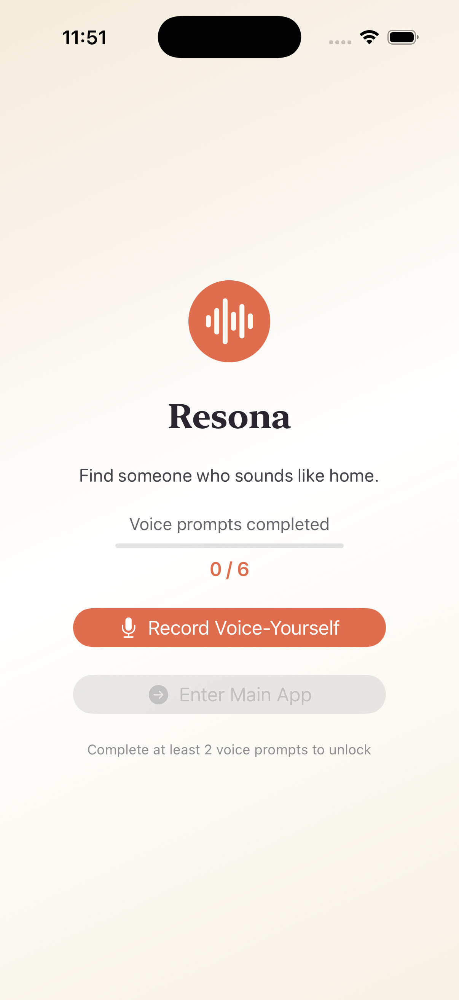
</p>

### Voice-Yourself: understand yourself through your voice

When you join Resona, you complete a **Voice-Yourself** session: 5–6 spoken prompts designed with psychology research (Big Five, Attachment Theory, Schwartz Values, Emotional Intelligence). The questions start easy — *"Describe a place where you feel completely at ease"* — then adapt based on what the AI still needs to learn about you.

Your voice is analyzed across two channels simultaneously:
- **What you say** — themes, values, emotional vocabulary, self-awareness
- **How you say it** — warmth, energy, fluency, engagement, tonal shifts

The result is a six-dimension psychological profile that captures who you are beneath the surface — not what you look like in golden hour.

<p align="center">
  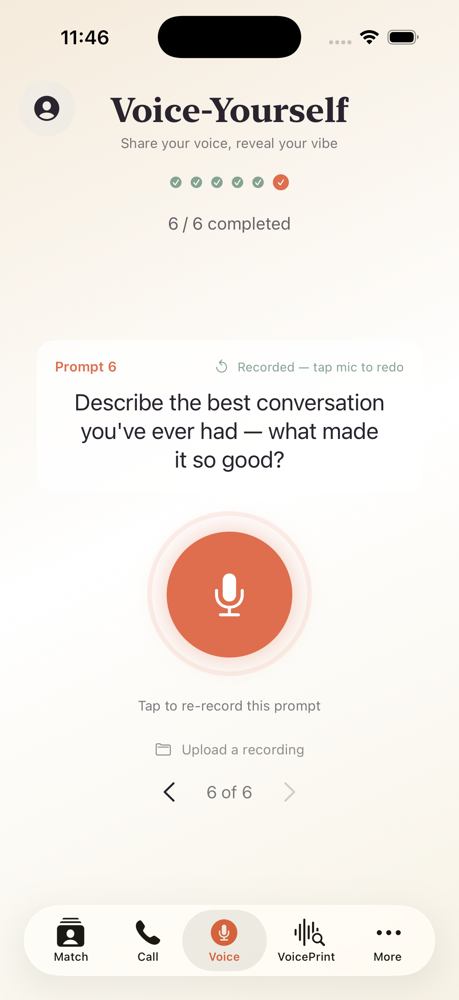
</p>

### Matching: find someone who sounds like home

Resona's matching algorithm weights **vocal and psychological compatibility at 70%**, with shared interests at 30%. It uses confidence-weighted scoring — dimensions the AI is uncertain about are down-weighted rather than guessed. The match deck shows you 15 people whose voices and minds resonate with yours.

<p align="center">
  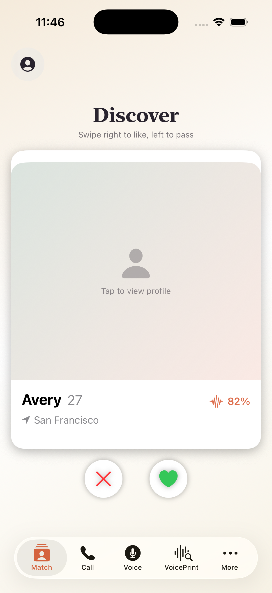
</p>

### Beyond matching

Once matched, Resona keeps listening. Voice messages and calls feed into a **Vibe Progress** engine that tracks how your connection is evolving — emotional trajectory, reciprocity, communication style compatibility — and surfaces insights through a personal Vibe Check report.

<p align="center">
  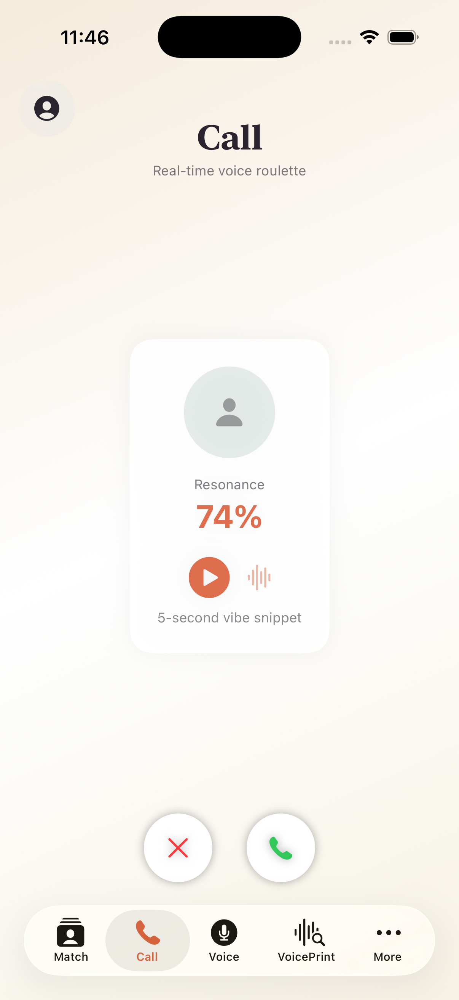
  &nbsp;&nbsp;
  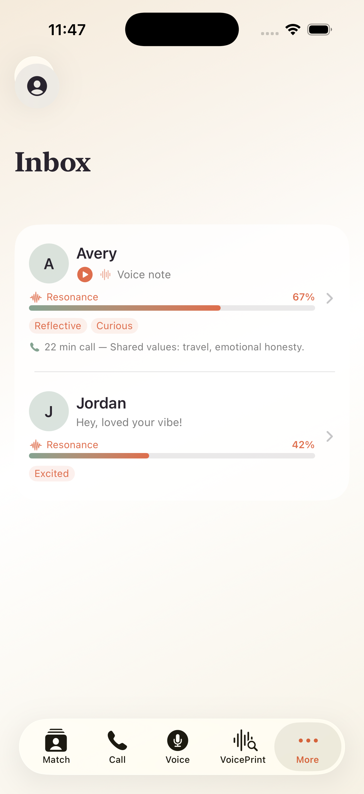
</p>

---

## 3. Getting Started

### 3.1 Quick Start (Local Development)

**Prerequisites:** macOS with Xcode 15+, Python 3.10+, [XcodeGen](https://github.com/yonaskolb/XcodeGen) (`brew install xcodegen`)

**Start the backend:**

```bash
cd backend
chmod +x run_local.sh
./run_local.sh
```

The API starts at `http://127.0.0.1:8000`. Browse interactive docs at `/docs`.

**Build the iOS app:**

```bash
cd frontend
xcodegen generate        # creates Resona.xcodeproj
open Resona.xcodeproj    # opens in Xcode — select simulator, Cmd+R
```

**Environment variables** (create a `.env` file in the project root):

```
EIGENAI_API_KEY=your_key_here
BOSON_AI_API_KEY=your_key_here
```

**Notes:**
- The iOS app connects to `http://127.0.0.1:8000` (Info.plist allows local HTTP).
- Backend uses SQLite (`backend/resona.db`) — delete the file to reset.
- Match and Call tabs require completing at least 2 Voice-Yourself prompts.

### 3.2 System Workflow

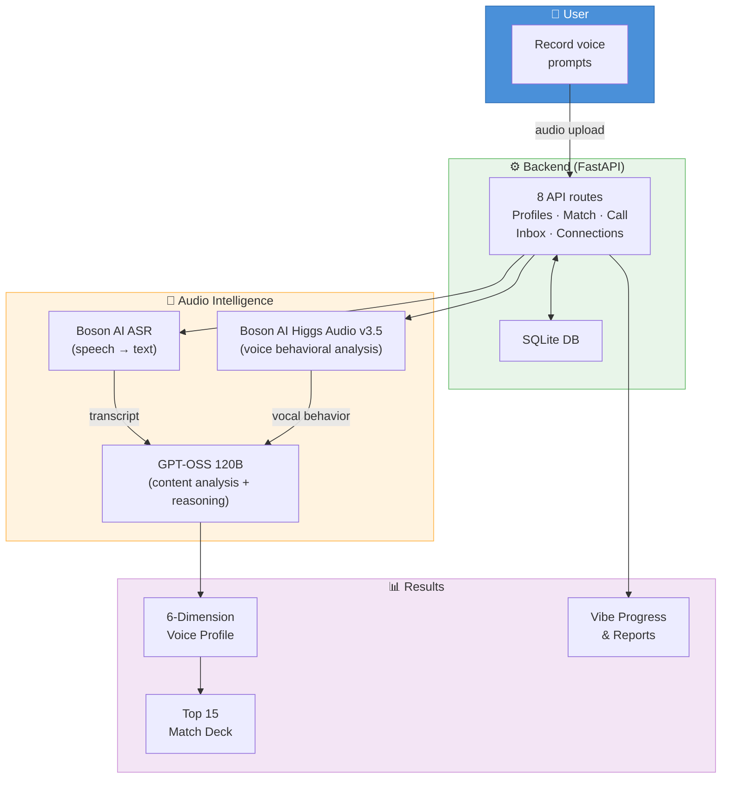

### Repository Layout

| Directory | Purpose |
|---|---|
| `backend/` | FastAPI service — profiles, messages, call metadata, orchestration |
| `frontend/` | iOS (SwiftUI) client app, 5-tab interface |
| `audio_intelligence/` | Voice feature extraction, analysis pipeline, recommendation logic |
| `design.md` | Full product requirements and feature definitions |
| `algorithm.md` | Algorithm specification (ontology, pipeline, matching, vibe progress) |
| `profiling.md` | Voice-powered user profiling pipeline details |

---

## 4. User Profiling Process

The voice profiling pipeline is a three-stage LLM architecture that processes each spoken answer through parallel audio analysis and content understanding, then fuses the results into a structured psychological profile.

**Full pipeline details, architecture diagram, and dimension definitions** → see [`profiling.md`](profiling.md)

**Key concepts:**
- **6 latent dimensions** (Emotional Openness, Relational Security, Conflict Style, Energy Orientation, Value Gravity, Self-Awareness) grounded in validated psychology theories
- **Parallel processing**: Boson AI ASR (transcription) and Higgs Audio v3.5 (vocal behavior) run simultaneously on each recording
- **Adaptive questioning**: a reasoning LLM selects the next prompt based on which dimensions remain uncertain (σᵢ ≥ 0.15)
- **Confidence-aware output**: the profile vector **v** = [d₁…d₆] is paired with uncertainty **σ** = [σ₁…σ₆] so the matching system can discount low-confidence dimensions

<p align="center">
  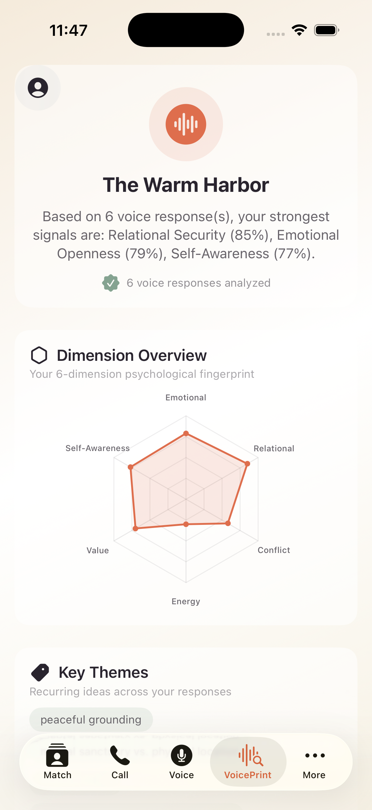
  &nbsp;&nbsp;
  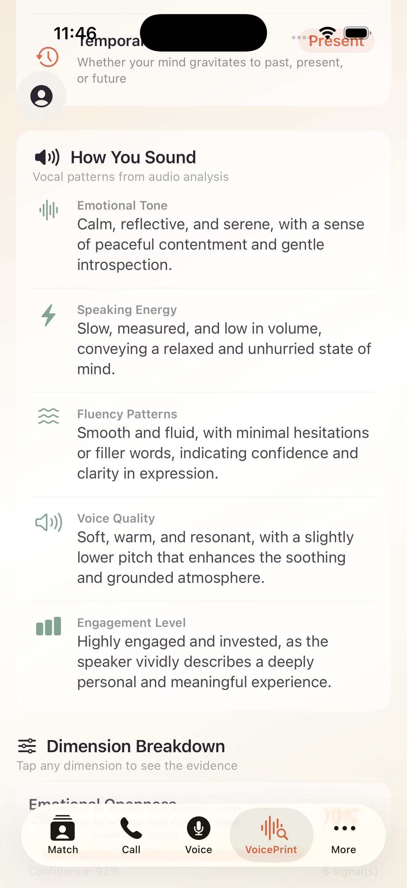
</p>
<p align="center">
  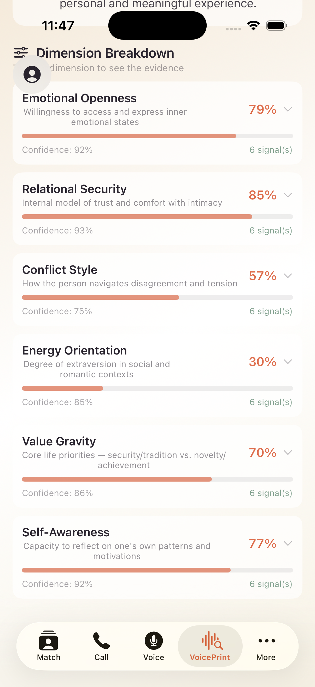
  &nbsp;&nbsp;
  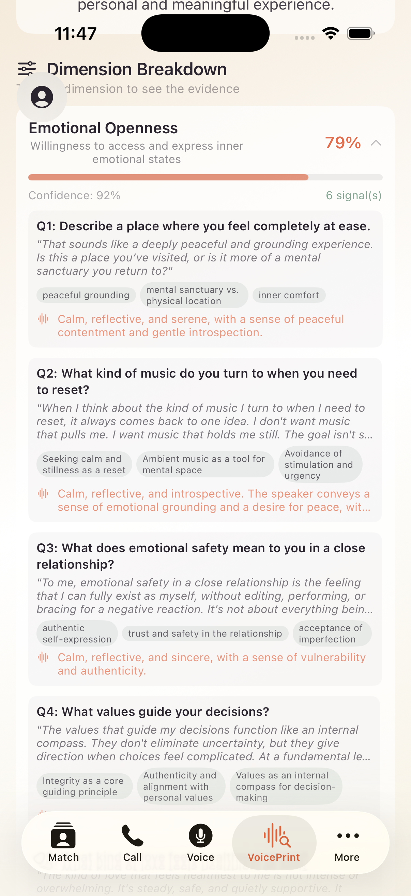
</p>

---

## 5. Limitations & Future Improvements

| Area | Current Limitation | Planned Improvement |
|---|---|---|
| **Scale** | Brute-force candidate scan; works up to ~10K users | ANN index (FAISS/ScaNN) for sub-linear retrieval |
| **Matching direction** | One-directional score(u, c) | Bidirectional — average of score(u,c) and score(c,u) |
| **Diversity** | Pure similarity ranking; can produce homogeneous decks | MMR (Maximal Marginal Relevance) for varied match batches |
| **β weight** | Fixed at 0.3 (interest vs. voice) for all users | Personalized β based on user engagement patterns |
| **Freshness** | No time decay on profiles | Boost recently active users, decay stale profiles |
| **Language** | English-only ASR and analysis | Multilingual support via Boson AI language expansion |
| **Acoustic features** | Fully LLM-based (no classical DSP) | Hybrid approach — add Praat/openSMILE features for robustness |
| **Validation** | No ground-truth match outcome data yet | Collect match-to-date conversion rates to validate dimension weights |

---

## 6. Demo

<!-- Embed demo video below when available -->
<!-- Replace VIDEO_ID with the actual YouTube video ID -->

[](https://youtu.be/lIJ7opw_kj4)


<!--
To embed directly (works on GitHub-rendered markdown with supported viewers):
[](https://www.youtube.com/watch?v=VIDEO_ID)
-->