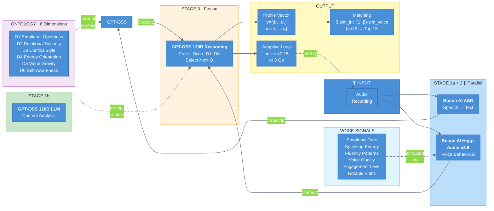

## Voice-powered User Profile Building

```mermaid
%%{init: {'theme': 'base', 'themeVariables': {'primaryColor': '#4A90D9', 'primaryTextColor': '#fff', 'primaryBorderColor': '#2D6EB5', 'lineColor': '#5C6B7A', 'fontSize': '13px'}, 'flowchart': {'rankSpacing': 35, 'nodeSpacing': 18, 'curve': 'basis', 'padding': 8}}}%%

flowchart LR
    subgraph IN["🎙️ INPUT"]
        AUD["Audio\nRecording"]
    end

    subgraph STAGE12["STAGE 1a + 2 ∥ Parallel"]
        direction TB
        ASR["<b>Boson AI ASR</b>\nSpeech → Text"]
        HIGGS["<b>Boson AI Higgs</b>\n<b>Audio v3.5</b>\nVoice Behavioral"]
    end

    subgraph STAGE1B["STAGE 1b"]
        OSS["<b>GPT-OSS 120B LLM</b>\nContent Analysis"]
    end

    subgraph STAGE3["STAGE 3 · Fusion"]
        REASON["<b>GPT-OSS 120B Reasoning</b>\nFuse · Score D1–D6\nSelect Next Q"]
    end

    subgraph ONT["ONTOLOGY · 6 Dimensions"]
        direction TB
        DIM["D1 Emotional Openness\nD2 Relational Security\nD3 Conflict Style\nD4 Energy Orientation\nD5 Value Gravity\nD6 Self-Awareness"]
    end

    subgraph SIGNALS["VOICE SIGNALS\n(Higgs Audio extracts)"]
        direction TB
        SIG["Emotional Tone\nSpeaking Energy\nFluency Patterns\nVoice Quality\nEngagement Level\nNotable Shifts"]
    end

    subgraph OUT["OUTPUT"]
        direction TB
        VEC["Profile Vector\n<b>v</b>=[d₁…d₆]\n<b>σ</b>=[σ₁…σ₆]"]
        MATCH["Matching\nβ·sim_int+(1−β)·sim_voice\nβ=0.3 → Top 15"]
        LOOP["Adaptive Loop\nuntil σᵢ<0.15\nor 6 Qs"]
    end

    AUD --> ASR & HIGGS
    ASR -->|transcript| GPT-OSS
    HIGGS -->|Output2| REASON
    GPT-OSS -->|Output1| REASON
    REASON --> VEC
    REASON --> LOOP
    VEC --> MATCH
    LOOP -.->|next Q| AUD

    ONT -.->|prompt\ncontext| GPT-OSS & REASON
    SIG -.->|extracted\nby| HIGGS

    style IN fill:#4A90D9,stroke:#2D6EB5,color:#fff
    style STAGE12 fill:#BBDEFB,stroke:#64B5F6,color:#333
    style STAGE1B fill:#C8E6C9,stroke:#81C784,color:#333
    style STAGE3 fill:#FFF3E0,stroke:#FFB74D,color:#333
    style ONT fill:#F3E5F5,stroke:#CE93D8,color:#333
    style SIGNALS fill:#E1F5FE,stroke:#4FC3F7,color:#333
    style OUT fill:#FFF9C4,stroke:#FDD835,color:#333
```